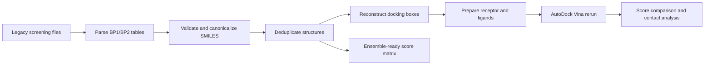

# FtsZ Coumarin Virtual Screening Reconstruction


A reproducible reconstruction of a legacy high-throughput virtual screening workflow for **coumarin-like compounds against FtsZ binding pockets**. The repository converts spreadsheet-based screening outputs into curated molecular tables, reconstructed pocket boxes, rerun docking results, residue-contact summaries, and an ensemble-ready score matrix.

The current analysis is limited to computational docking reconstruction and candidate prioritization. Docking scores and poses are not interpreted as experimental activity measurements.

For file-by-file navigation guides, see `PROJECT_INDEX.md` and `PROJECT_INDEX_CN.md`.

## Summary

| Output | Result |
|---|---:|
| Method-level records parsed | 204 |
| Valid SMILES records | 204 / 204 |
| Unique pocket-compound records | 127 |
| Unique desalted structures | 90 |
| Ensemble-ready matrix rows | 88 |
| Top-candidate Vina reruns | 20 / 20 completed |


## Methods

- **Data reconstruction**: parses legacy BP1/BP2 screening workbooks into normalized candidate tables.
- **Ligand standardization**: validates SMILES, removes salts, canonicalizes structures, merges duplicate entries, and computes RDKit descriptors.
- **Pocket reconstruction**: maps BP1 and BP2 to source pocket-detection outputs using pocket centers, volumes, and residue anchors.
- **Docking rerun**: rebuilds receptor/ligand inputs and reruns AutoDock Vina for top drug-like structures from each pocket.
- **Contact analysis**: summarizes receptor residues within 4 Å of the top rerun pose for each pocket.
- **Ensemble-ready output**: exports a compound-by-pocket score matrix for subsequent ensemble or EnOpt-style reranking experiments.

## Workflow



## Key Figures

| Score distribution | Top candidate structures |
|---|---|
|  |  |

| Rerun score comparison | Pocket overlap |
|---|---|
|  |  |

| Binding-mode contact views |
|---|
|  |

## Repository Contents

| Path | Description |
|---|---|
| `PROJECT_INDEX.md` | File-by-file navigation guide |
| `PROJECT_INDEX_CN.md` | Chinese file-by-file navigation guide |
| `docs/technical_report.md` | Technical report with methodology, results, caveats, and rerun commands |
| `docs/technical_report_cn.md` | Chinese technical report covering the same reconstruction and limitations |
| `docs/data_availability.md` | Data-availability notes and raw-input layout for full reruns |
| `notebooks/ftsZ_reconstruction.ipynb` | Notebook companion for reviewing tables and figures |
| `data/processed/bp_unique_structures.csv` | Structure-deduplicated BP1/BP2 candidate table |
| `data/processed/enopt_score_matrix.csv` | Two-pocket ensemble-ready score matrix |
| `results/tables/vina_rerun_top_structures.csv` | Legacy-vs-rerun docking score comparison |
| `results/tables/binding_contacts_top_hits.csv` | 4 Å residue-contact summary for top rerun hits |
| `results/figures/binding_mode_top_hits.png` | BP1/BP2 binding-mode contact visualization |
| `results/pymol/` | PyMOL-ready rendering scripts for locally restored docking poses |

## Reproducibility

The repository includes processed tables, final figures, scripts, and reports. Original spreadsheets, receptor structures, pocket-detection exports, article PDFs, and docking intermediates are managed outside version control; see `docs/data_availability.md` for details.

Review the processed outputs and regenerate figures:

```bash
python3 -m venv .venv
. .venv/bin/activate
python -m pip install -r requirements.txt
python -m compileall -q scripts
python scripts/draw_top_ligands.py
python scripts/make_summary_figure.py
```

Run the complete workflow after restoring raw inputs under `data/raw/drive/`:

```bash
python3 -m venv .venv
. .venv/bin/activate
python -m pip install -r requirements.txt
micromamba create -y -p .mamba_vina -f environment-vina.yml

python scripts/clean_candidates.py
python scripts/derive_pocket_boxes.py
python scripts/prepare_docking_inputs.py --top-n 10 --drug-like-only --max-heavy-atoms 35
python scripts/run_vina_batch.py --exhaustiveness 4 --cpu 4
python scripts/analyze_binding_contacts.py
python scripts/draw_top_ligands.py
python scripts/draw_binding_mode_views.py
python scripts/make_summary_figure.py
```

AutoDock Vina and OpenBabel are isolated in `.mamba_vina` via `environment-vina.yml`; Python analysis dependencies are listed in `requirements.txt`.

## Project Structure

```text
.
├── data/processed/              # Curated derived tables
├── docs/                        # Technical reports and data-availability notes
├── notebooks/                   # Notebook companion
├── results/figures/             # Generated analysis figures
├── results/pymol/               # PyMOL-ready local rendering scripts
├── results/tables/              # Summary and rerun-result tables
├── scripts/                     # Cleaning, docking, analysis, and plotting scripts
├── environment-vina.yml         # Vina/OpenBabel conda environment
└── requirements.txt             # Python analysis dependencies
```

## Methodological Notes

- BP1 and BP2 are treated as distinct binding pockets, not conformers of one binding site.
- Docking boxes were reconstructed from pocket-detection outputs and residue anchors because the original docking configuration was not available.
- The current score matrix is suitable as an ensemble-style baseline or EnOpt-ready input, but it is not a supervised EnOpt model.
- Docking scores and contact views are interpreted only as computational prioritization evidence rather than biochemical potency measurements.

## Future Work

- Recover the original docking configuration if available and compare against the reconstructed boxes.
- Add multiple FtsZ conformations or MD snapshots for a true conformation-ensemble workflow.
- Add active/decoy labels or a documented benchmark set before supervised EnOpt-style reranking.
- Refine selected binding modes with PyMOL ray-traced figures or 2D interaction diagrams.
