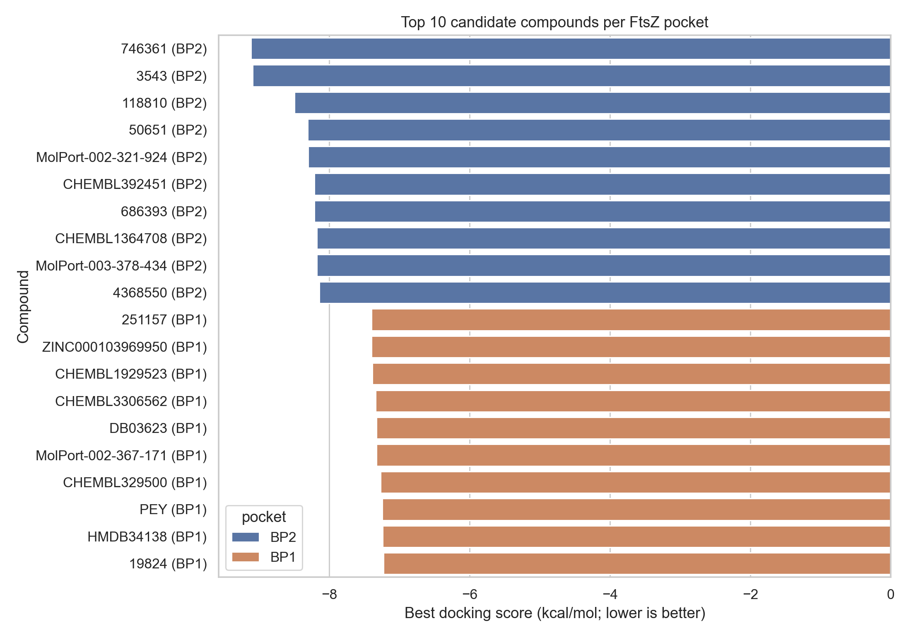

# Technical Report: FtsZ Coumarin HTVS Reconstruction and Rerun

## Executive summary

This stage reconstructs a legacy FtsZ/coumarin virtual-screening workflow into a reproducible project structure. The BP1/BP2 candidate spreadsheets were cleaned, SMILES strings were validated and canonicalized, two FtsZ pocket boxes were reconstructed from source ezPocket outputs and residue anchors, and a pilot AutoDock Vina rerun was completed for the top drug-like structures from each pocket.

Key numbers:

| pocket   |   method_records |   valid_method_records |   unique_ids |   min_score |   median_score |   max_score |
|:---------|-----------------:|-----------------------:|-------------:|------------:|---------------:|------------:|
| BP1      |              101 |                    101 |           55 |      -7.396 |         -6.98  |      -6.318 |
| BP2      |              103 |                    103 |           72 |      -9.116 |         -7.429 |      -5.969 |

Additional structure-level deduplication produced **90 unique pocket-structure records** and an **88-row EnOpt-ready score matrix**.

## Source inputs used

| Input | Local path | Role |
|---|---|---|
| Thesis/project notes | managed locally | Original project narrative, methods, BP1/BP2 interpretation |
| EnOpt reference paper | managed locally | Methodological reference for ensemble/ML reranking |
| BP1 workbook | `data/raw/drive/BP1_candidates.xlsx` | Source table for pocket 1 |
| BP2 workbook | `data/raw/drive/BP2_candidates.xlsx` | Source table for pocket 2 |
| Receptor PDB | `data/raw/drive/Receptor_from_fconv.pdb` | Receptor source used for local docking preparation |
| Pocket outputs | `data/raw/drive/ezPocket_*.tsv` | Pocket-center and volume source files |

## Data cleaning

The old workbooks preserve legacy column labels, so the first spreadsheet block was interpreted by content rather than by header text:

- column 1: compound/source ID
- column 2: original docking score, kcal/mol
- column 3: Tanimoto similarity to the coumarin reference query
- column 4: SMILES
- column 5: fingerprint method

RDKit was used to validate SMILES, canonicalize structures, remove salts by keeping the largest fragment, and calculate light drug-likeness descriptors.

Primary cleaned outputs:

- `data/processed/bp_method_records.csv`
- `data/processed/bp_unique_compounds.csv`
- `data/processed/bp_unique_structures.csv`
- `data/processed/enopt_score_matrix.csv`

## Pocket reconstruction

The two binding pockets were mapped to source pocket-detection outputs using the residue anchors described in the original project notes.

| pocket   | source                          |   center_x |   center_y |   center_z |   size_x |   size_y |   size_z | thesis_residue_anchor                                         |
|:---------|:--------------------------------|-----------:|-----------:|-----------:|---------:|---------:|---------:|:--------------------------------------------------------------|
| BP1      | ezPocket_fpocket3.tsv / Pocket1 |   -50.6447 |    35.0742 |   15.2025  |     22.5 |     22.5 |     22.5 | Ala39B, Asn41B, Leu47B, Met49B, Ser50B, Lys55B                |
| BP2      | ezPocket_fconv.tsv / Pocket0    |   -63.4691 |    20.8178 |    1.73489 |     22.5 |     22.5 |     22.5 | Met169B, Glu185B, Asn189B, Ile225B, Gly226B, Ser227B, Arg304B |

The Vina box sizes are estimated from source pocket centers/volumes and residue anchors. If the original ezSMDock/Vina box configuration is recovered later, these values should be replaced and the rerun can be repeated without changing the rest of the pipeline.

## Original candidate ranking after structure deduplication

### BP1 top structures

| compound_ids            | source_databases          |   best_docking_score_kcal_mol |   max_tanimoto_to_reference |   mol_weight |   logp | passes_lipinski_light   |
|:------------------------|:--------------------------|------------------------------:|----------------------------:|-------------:|-------:|:------------------------|
| 251157;ZINC000103969950 | ZINC15;numeric library ID |                        -7.396 |                       0.88  |      226.231 |  2.96  | True                    |
| CHEMBL1929523           | ChEMBL23                  |                        -7.388 |                       0.6   |      236.226 |  3.692 | True                    |
| CHEMBL3306562           | ChEMBL23                  |                        -7.338 |                       0.75  |      237.214 |  2.523 | True                    |
| DB03623                 | DrugBank                  |                        -7.328 |                       0.316 |      272.307 |  4.156 | True                    |
| MolPort-002-367-171     | MolPort                   |                        -7.327 |                       0.846 |      190.198 |  2.115 | True                    |
| CHEMBL329500            | ChEMBL23                  |                        -7.27  |                       0.913 |      288.302 |  4.319 | True                    |
| PEY                     | PDB ligand                |                        -7.242 |                       0.659 |      178.234 |  3.993 | True                    |
| HMDB34138               | HMDB                      |                        -7.241 |                       0.786 |      284.223 |  2.809 | True                    |
| 19824                   | numeric library ID        |                        -7.229 |                       0.282 |      275.351 |  4.226 | True                    |
| CHEMBL3409185           | ChEMBL23                  |                        -7.206 |                       0.571 |      321.126 |  3.979 | True                    |

### BP2 top structures

| compound_ids                           | source_databases                   |   best_docking_score_kcal_mol |   max_tanimoto_to_reference |   mol_weight |   logp | passes_lipinski_light   |
|:---------------------------------------|:-----------------------------------|------------------------------:|----------------------------:|-------------:|-------:|:------------------------|
| 746361                                 | numeric library ID                 |                        -9.116 |                       0.441 |      344.326 |  4.714 | True                    |
| 3543                                   | numeric library ID                 |                        -9.093 |                       0.265 |      380.451 |  7.993 | False                   |
| 118810                                 | numeric library ID                 |                        -8.495 |                       0.694 |      282.295 |  3.386 | True                    |
| 50651                                  | numeric library ID                 |                        -8.307 |                       0.241 |      336.778 |  4.932 | True                    |
| MolPort-002-321-924                    | MolPort                            |                        -8.303 |                       0.562 |      408.322 |  1.385 | True                    |
| 686393;CHEMBL392451                    | ChEMBL23;numeric library ID        |                        -8.211 |                       0.633 |      746.68  |  7.295 | False                   |
| CHEMBL1364708;MolPort-003-378-434      | ChEMBL23;MolPort                   |                        -8.175 |                       0.475 |      278.263 |  3.912 | True                    |
| 4368550;CHEMBL1801014;ZINC000000057885 | ChEMBL23;ZINC15;numeric library ID |                        -8.141 |                       0.913 |      288.302 |  4.319 | True                    |
| 7524                                   | numeric library ID                 |                        -8.124 |                       0.315 |      673.8   |  1.356 | False                   |
| 656562                                 | numeric library ID                 |                        -8.08  |                       0.818 |      296.325 |  5.253 | False                   |

## AutoDock Vina rerun

A pilot rerun was completed for the top 10 drug-like structures from BP1 and BP2. Ligand 3D coordinates were regenerated from the cleaned SMILES strings, receptor and ligand PDBQT files were prepared with an OpenBabel fallback, and Vina 1.2.7 was run with exhaustiveness 4 and seed 20260724.

| pocket   | compound_ids                           |   old_best_docking_score_kcal_mol |   new_vina_score_kcal_mol |   score_delta_new_minus_old |
|:---------|:---------------------------------------|----------------------------------:|--------------------------:|----------------------------:|
| BP1      | 251157;ZINC000103969950                |                            -7.396 |                    -7.466 |                      -0.07  |
| BP1      | CHEMBL1929523                          |                            -7.388 |                    -7.571 |                      -0.183 |
| BP1      | CHEMBL3306562                          |                            -7.338 |                    -6.865 |                       0.473 |
| BP1      | DB03623                                |                            -7.328 |                    -7.655 |                      -0.327 |
| BP1      | MolPort-002-367-171                    |                            -7.327 |                    -7.247 |                       0.08  |
| BP1      | CHEMBL329500                           |                            -7.27  |                    -7.664 |                      -0.394 |
| BP1      | PEY                                    |                            -7.242 |                    -7.367 |                      -0.125 |
| BP1      | HMDB34138                              |                            -7.241 |                    -7.51  |                      -0.269 |
| BP1      | 19824                                  |                            -7.229 |                    -7.873 |                      -0.644 |
| BP1      | CHEMBL3409185                          |                            -7.206 |                    -7.282 |                      -0.076 |
| BP2      | 746361                                 |                            -9.116 |                    -9.761 |                      -0.645 |
| BP2      | 118810                                 |                            -8.495 |                    -8.985 |                      -0.49  |
| BP2      | 50651                                  |                            -8.307 |                    -8.76  |                      -0.453 |
| BP2      | MolPort-002-321-924                    |                            -8.303 |                    -9.173 |                      -0.87  |
| BP2      | CHEMBL1364708;MolPort-003-378-434      |                            -8.175 |                    -8.959 |                      -0.784 |
| BP2      | 4368550;CHEMBL1801014;ZINC000000057885 |                            -8.141 |                    -9.201 |                      -1.06  |
| BP2      | HMDB30796;LSM-36988;MRI                |                            -7.943 |                    -7.95  |                      -0.007 |
| BP2      | 71881                                  |                            -7.856 |                    -8.611 |                      -0.755 |
| BP2      | 338;DB07009                            |                            -7.843 |                    -9.092 |                      -1.249 |
| BP2      | HMDB30821                              |                            -7.718 |                    -8.717 |                      -0.999 |

Correlation between legacy worksheet scores and rerun Vina scores:

| scope   |   n |   pearson_r |   pearson_p |   spearman_r |   spearman_p |
|:--------|----:|------------:|------------:|-------------:|-------------:|
| BP1     |  10 |      -0.171 |      0.6369 |       -0.139 |       0.7009 |
| BP2     |  10 |       0.68  |      0.0304 |        0.503 |       0.1383 |
| overall |  20 |       0.893 |      0      |        0.797 |       0      |

Figures:





## Binding-pose contact summary

For the best rerun hit from each pocket, receptor residues within 4 Å of the top Vina pose were summarized as a lightweight binding-mode check. This does not replace manual PyMOL/Discovery Studio inspection, but it confirms that rerun poses are placed around residues discussed in the thesis.

| pocket   |   compound_ids | residue   |   min_distance_a |   contact_count_within_4a | has_polar_candidate_within_3_5a   |
|:---------|---------------:|:----------|-----------------:|--------------------------:|:----------------------------------|
| BP1      |          19824 | SER50B    |            3.228 |                         9 | True                              |
| BP1      |          19824 | ASP57B    |            3.301 |                         4 | False                             |
| BP1      |          19824 | MET49B    |            3.485 |                        12 | False                             |
| BP1      |          19824 | LEU48B    |            3.587 |                         2 | False                             |
| BP1      |          19824 | LYS55B    |            3.601 |                        12 | False                             |
| BP1      |          19824 | LEU47B    |            3.681 |                         7 | False                             |
| BP1      |          19824 | ALA39B    |            3.748 |                         2 | False                             |
| BP1      |          19824 | ASN41B    |            3.969 |                         1 | False                             |
| BP1      |          19824 | LEU56B    |            3.974 |                         2 | False                             |
| BP2      |         746361 | THR306B   |            2.825 |                         7 | True                              |
| BP2      |         746361 | VAL305B   |            2.949 |                         3 | True                              |
| BP2      |         746361 | SER260B   |            3.052 |                         5 | False                             |
| BP2      |         746361 | ASN189B   |            3.119 |                        12 | True                              |
| BP2      |         746361 | ARG304B   |            3.269 |                        18 | True                              |
| BP2      |         746361 | ASP196B   |            3.276 |                         4 | False                             |
| BP2      |         746361 | ALA262B   |            3.364 |                         7 | False                             |
| BP2      |         746361 | ILE225B   |            3.59  |                        11 | False                             |
| BP2      |         746361 | GLU185B   |            3.726 |                         1 | False                             |
| BP2      |         746361 | VAL294B   |            3.894 |                         3 | False                             |
| BP2      |         746361 | GLY193B   |            3.929 |                         1 | False                             |

Additional output:

- `results/tables/binding_contacts_top_hits.csv`
- `results/figures/top_ligand_structures.png`
- `results/figures/binding_mode_top_hits.png`
- `results/pymol/` with PyMOL-ready rendering scripts for locally restored docking poses


## EnOpt / ensemble update

The current cleaned matrix has the correct high-level shape for ensemble-style reranking: compounds as rows and pocket/structure score columns as features. The file is:

- `data/processed/enopt_score_matrix.csv`

Important methodological note for CADD review: the current BP1/BP2 columns are two binding pockets, not multiple conformations of the same pocket. Therefore, this stage should be described as an **EnOpt-ready reconstruction and two-pocket ensemble baseline**, not as a strict supervised EnOpt model. A strict EnOpt run should add either:

1. multiple FtsZ conformations for the same binding pocket, plus active/decoy labels; or
2. a clearly documented surrogate-label experiment, marked as exploratory rather than experimental activity prediction.

Current baseline columns include:

- `BP1`, `BP2`
- `ensemble_best_score_kcal_mol`
- `ensemble_mean_score_kcal_mol`
- `rank_ensemble_best`
- `rank_ensemble_mean`

## Reproducibility commands

The repository includes processed tables and final figures. A full raw-to-docking rerun requires restoring the raw inputs listed in `docs/data_availability.md`.

Public review / figure regeneration:

```bash
python3 -m venv .venv
. .venv/bin/activate
python -m pip install -r requirements.txt
python -m compileall -q scripts
python scripts/draw_top_ligands.py
python scripts/make_summary_figure.py
```

Full local rerun with raw source files:

```bash
python3 -m venv .venv
. .venv/bin/activate
python -m pip install -r requirements.txt
micromamba create -y -p .mamba_vina -f environment-vina.yml
python scripts/clean_candidates.py
python scripts/derive_pocket_boxes.py
python scripts/prepare_docking_inputs.py --top-n 10 --drug-like-only --max-heavy-atoms 35
python scripts/run_vina_batch.py --exhaustiveness 4 --cpu 4
python scripts/analyze_binding_contacts.py
python scripts/draw_top_ligands.py
python scripts/draw_binding_mode_views.py
python scripts/make_summary_figure.py
```

Vina and OpenBabel were installed in `.mamba_vina` from conda-forge for the local rerun.

## Limitations and next steps

- The exact original docking box file was not available, so box sizes are reconstructed estimates.
- Some old candidates are very large or violate light Lipinski filters; they are retained in the cleaned tables but excluded from the fast top drug-like rerun.
- The source files lack experimental active/inactive labels; strict ML-EnOpt model training is outside the scope of this stage.
- Docking score changes should be interpreted as rerun consistency evidence, not biological validation.
- The next rigorous extension is to add multiple FtsZ receptor conformations for each pocket, generate a true compound × conformation matrix, and then run an EnOpt-style supervised/benchmarkable reranking.
