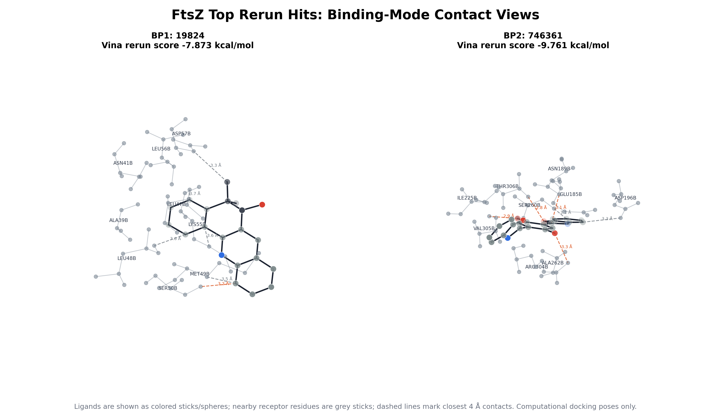

# 技术报告：FtsZ 香豆素类似物 HTVS 流程复现与复跑

## 摘要

本项目将既有 FtsZ 高通量虚拟筛选资料整理为一套可复现的 CADD 分析流程。输入资料包括 BP1、BP2 两个结合口袋的候选分子表、口袋检测输出和部分对接结果；本项目将其转化为结构化数据、可复跑脚本和可审阅图表。

当前工作包括：候选表解析、SMILES 标准化、去盐与重复结构合并、BP1/BP2 口袋盒子重建、Top drug-like 候选分子 AutoDock Vina 复跑、旧分数与复跑分数对比、最优复跑分子近邻残基分析，以及 EnOpt-ready 的二维 score matrix。

> 方法边界：本项目应表述为 FtsZ HTVS 流程复现、两口袋 ensemble baseline 与 EnOpt-ready 数据整理。由于当前资料没有实验 active/decoy 标签，也没有同一 pocket 的多构象蛋白 ensemble，因此不应解读为严格的 supervised EnOpt 模型或实验活性验证。

## 项目背景

原始研究关注 FtsZ 蛋白的潜在抑制剂筛选，候选小分子主要来自多个公开/商业化分子库，并以 coumarin analogue 相关骨架为中心进行虚拟筛选。本项目目标是将原本分散在论文说明、Excel 结果表、pocket detection 输出和 docking 输出中的信息重建为一个结构化计算流程，便于方法复核、结果追踪和后续扩展。

## 数据整理结果

| 指标 | BP1 | BP2 | 合计 / 说明 |
|---|---:|---:|---|
| 原始方法层面记录 | 101 | 103 | 204 条 |
| 有效 SMILES 记录 | 101 | 103 | 204 / 204 |
| 去重后 compound ID | 55 | 72 | 按 pocket 统计 |
| 原始 docking score 最小值 | -7.396 | -9.116 | kcal/mol，越低越好 |
| 原始 docking score 中位数 | -6.980 | -7.429 | kcal/mol |
| 原始 docking score 最大值 | -6.318 | -5.969 | kcal/mol |
| 去盐 + 结构去重后结构数 |  |  | 90 个 unique structures |
| EnOpt-ready matrix |  |  | 88 行 |

主要清洗逻辑包括：

- 解析旧 Excel 表格中实际对应的 compound ID、原始 docking score、Tanimoto、SMILES 与 fingerprint method 字段；
- 使用 RDKit 校验并 canonicalize SMILES；
- 去除盐和 counter-ion，按 canonical desalted SMILES 合并重复结构；
- 保留不同数据库来源信息，避免同一结构在 ChEMBL、DrugBank、HMDB、MolPort、ZINC 等来源中重复计数；
- 生成方法层面表、compound 层面表、结构层面表和 compound × pocket score matrix。

## 口袋重建

由于输入资料中未找到原始 Vina config 或 ezSMDock 批量配置，本项目根据 pocket detection 输出和文献/原始说明中提到的关键残基重建 BP1/BP2 docking box。该 box 用于本次复现分析，并标注为 estimated docking box。

| Pocket | 口袋来源 | Center X | Center Y | Center Z | Box size | 残基锚点 |
|---|---|---:|---:|---:|---:|---|
| BP1 | `ezPocket_fpocket3.tsv / Pocket1` | -50.6447 | 35.0742 | 15.2025 | 22.5 Å × 22.5 Å × 22.5 Å | Ala39B, Asn41B, Leu47B, Met49B, Ser50B, Lys55B |
| BP2 | `ezPocket_fconv.tsv / Pocket0` | -63.4691 | 20.8178 | 1.7349 | 22.5 Å × 22.5 Å × 22.5 Å | Met169B, Glu185B, Asn189B, Ile225B, Gly226B, Ser227B, Arg304B |

## Vina 复跑结果

从每个 pocket 中选择 Top10 drug-like unique structures 进行 AutoDock Vina 复跑。受体使用 FtsZ receptor PDB；配体由 SMILES 重新生成 3D 构象，并转换为 PDBQT。Vina / OpenBabel 环境通过 `environment-vina.yml` 独立记录。

| Pocket | 复跑数量 | 成功数量 | 最优复跑 compound | 原始 score | 复跑 score | 分数变化 |
|---|---:|---:|---|---:|---:|---:|
| BP1 | 10 | 10 | 19824 | -7.229 | -7.873 | -0.644 |
| BP2 | 10 | 10 | 746361 | -9.116 | -9.761 | -0.645 |
| 合计 | 20 | 20 |  |  |  |  |

分数相关性结果：

| 范围 | n | Pearson r | Pearson p | Spearman r | Spearman p |
|---|---:|---:|---:|---:|---:|
| BP1 | 10 | -0.171 | 0.6369 | -0.139 | 0.7009 |
| BP2 | 10 | 0.680 | 0.0304 | 0.503 | 0.1383 |
| Overall | 20 | 0.893 | 0.0000 | 0.797 | 0.0000 |

解释建议：

- Overall 相关性较高，说明重建流程与旧表格分数整体方向一致；
- BP2 的 Pearson 相关性更稳定，Top hit 在复跑中仍保持较强 docking score；
- BP1 的 Top10 内部排序变化较大，可能与 docking box 重建、配体构象、质子化/电荷处理、随机种子或原始参数缺失有关；
- 该结果适合作为复现一致性与结构解释分析，不应作为实验活性证据。

## 结合模式辅助分析

为补充分数之外的结构层面信息，本项目对每个 pocket 的复跑最优分子计算了 4 Å 内近邻残基。

| Pocket | Top compound | 复跑 score | 近邻残基摘要 |
|---|---|---:|---|
| BP1 | 19824 | -7.873 | SER50B, ASP57B, MET49B, LEU48B, LYS55B, LEU47B, ALA39B, ASN41B, LEU56B |
| BP2 | 746361 | -9.761 | THR306B, VAL305B, SER260B, ASN189B, ARG304B, ASP196B, ALA262B, ILE225B, GLU185B, VAL294B, GLY193B |

其中 BP1 命中残基包括 SER50B、MET49B、LYS55B、LEU47B、ALA39B、ASN41B，能对应 BP1 残基锚点；BP2 命中残基包括 ASN189B、ARG304B、ILE225B、GLU185B，也能对应 BP2 的关键区域。这个结果可用于结合模式讨论，但仍属于 docking pose 层面的计算证据。



同时提供 `results/pymol/` 下的 PyMOL-ready 脚本；如果在本地恢复 receptor 和 docking pose 文件，可以用 PyMOL 进一步渲染 ray-traced 图或 2D interaction diagram。

## 图表输出

| 图 | 用途 |
|---|---|
| `results/figures/workflow_summary.png` | README 顶部流程与结果汇总图 |
| `results/figures/score_distribution_by_pocket.png` | BP1/BP2 原始分数分布对比 |
| `results/figures/top10_scores_by_pocket.png` | 各 pocket Top10 候选分子排序 |
| `results/figures/vina_rerun_vs_original_scores.png` | 原始分数与 Vina 复跑分数对比 |
| `results/figures/bp_score_scatter_overlap.png` | 两个 pocket 之间候选分子重叠与分数关系 |
| `results/figures/top_ligand_structures.png` | Top 候选分子 2D 结构图 |
| `results/figures/binding_mode_top_hits.png` | BP1/BP2 复跑最优分子的结合模式接触图 |
| `results/pymol/` | PyMOL-ready 结合模式渲染脚本 |

## EnOpt / ensemble 方法边界

参考文献中的 EnOpt 是用于提升 ensemble virtual screening 排序效果和可解释性的机器学习方法。严格意义上，EnOpt 通常需要：

- 多个蛋白构象或多个 docking score channels；
- 已知 active / decoy 或其他可监督标签；
- 可用于训练、验证和解释权重的 benchmark 数据。

当前资料提供的是 BP1 与 BP2 两个 binding pockets 的 score，而不是同一个 pocket 的多个 receptor conformations，也没有 experimental active / inactive labels。因此，本项目生成的是 EnOpt-ready score matrix 和 two-pocket ensemble baseline。更严格的 EnOpt-style reranking 需要补充多构象 receptor ensemble 或活性/decoy benchmark。

## 当前局限

- 原始 docking box/config 未找到，因此本项目 box 来自 pocket detection 输出和残基锚点的重建估计；
- 复跑只覆盖每个 pocket Top10 drug-like unique structures，用于方法复核，不代表全库重新筛选；
- 受体制备采用 OpenBabel PDBQT 流程；更严格的研究版本可进一步加入质子化状态、缺失残基、水分子和金属离子处理策略；
- docking score 仅是计算筛选指标，不等于 IC50、MIC 或其他实验活性；
- 当前 EnOpt 仅为 ready matrix 和 baseline，不是最终 supervised ML model。

## 后续工作

1. 在现有结合模式接触图和 `results/pymol/` 脚本基础上，进一步生成 PyMOL ray-traced 图和 2D interaction diagram；
2. 为 FtsZ 加入多个构象或不同 PDB/MD snapshots，形成真正的 compound × conformation docking matrix；
3. 寻找 FtsZ 已知 active / inactive 或 decoy set，训练并验证 EnOpt-style reranking；
4. 将当前 pipeline 结构迁移到其他靶点时，需要重新建立 receptor ensemble、小分子库抽样和验证设计。

## 可复现命令

公开仓库包含 processed tables 和最终 figures；如果要从原始 Excel / receptor / pocket files 完整复跑，需要先把原始输入文件按 `docs/data_availability.md` 放回 `data/raw/drive/`。

公开输出检查 / 图表再生成：

```bash
python3 -m venv .venv
. .venv/bin/activate
python -m pip install -r requirements.txt
python -m compileall -q scripts
python scripts/draw_top_ligands.py
python scripts/make_summary_figure.py
```

本地完整复跑：

```bash
python3 -m venv .venv
. .venv/bin/activate
python -m pip install -r requirements.txt
micromamba create -y -p .mamba_vina -f environment-vina.yml

python scripts/clean_candidates.py
python scripts/derive_pocket_boxes.py
python scripts/prepare_docking_inputs.py --top-n 10 --drug-like-only --max-heavy-atoms 35
python scripts/run_vina_batch.py --exhaustiveness 4 --cpu 4
python scripts/analyze_binding_contacts.py
python scripts/draw_top_ligands.py
python scripts/draw_binding_mode_views.py
python scripts/make_summary_figure.py
```
